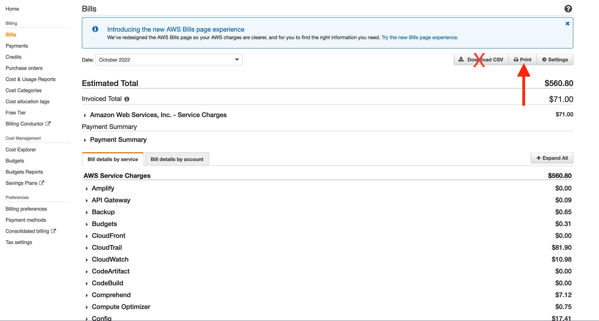
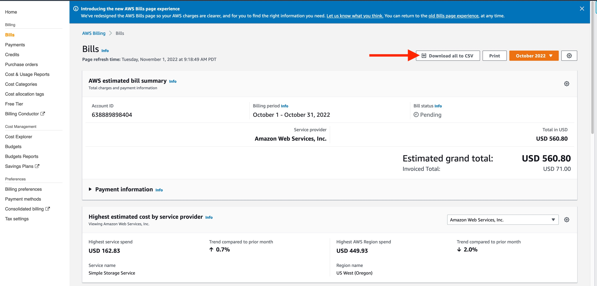

# How to Download the AWS Bill
As of November 2022, there are two UIs to the AWS Billing Console, each needing slightly different instructions.

## The “Old Console”
This is what the old console looks like:

If you’re using this console, then select the month you want, click ‘Print’, and save as a PDF (not a CSV!).

## The “New Console”
This is what the new console looks like:

If you’re using this console, then select the month you want, then click ‘Download all to CSV’.

## Invoices

The AWS Bill is distinct from the AWS Invoice, which can be found under the Payments link on the left. The AWS invoice contains summarized information and doesn't give us enough detail to work with.

## Cost & Usage Report

The Cost & Usage Report is an extremely detailed raw accounting of your AWS usage. We often rely on the CUR during engagements, but it is not useful to us pre-engagement as it requires we have access to your environment.
